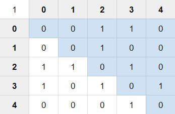
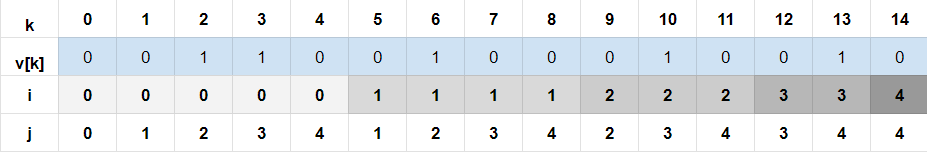

<b> Trabalho de Disciplina

Análise de Projeto de Algorítmos - 2035002 - 2024.1-A

Programa de Pós Graduação em Ciência da Computação
Mestrado em Ciência da Computação
Universidade Federal de Juiz de Fora
Departamento de Ciência da Computação

Discentes</b>
- Rafael Freesz Resende Corrêa
- Pedro José de Sousa Filho;

<b>Docente:</b> Raul Fonseca Neto

## Considerações Gerais

1. Para o referido trabalho, foram utilizadas as estruturas de dados a seguir:

~~~c++
//Representação do Grafo
class Grafo {
public:
    int grau; //quantidade de arestas próprias
    int ordem; //quantidade de vertices;
    bool** adjacencia; //Matriz de adjacencia binária
};

//Representação de matrizes
class Matriz {
public:
    int n; //Ordem da matriz
    int** m; //Matriz
};
~~~
2. Todos os códigos e estruturas utilizados para a os algoritmos mencionados estão presentes neste repositório.

3. O comando para compilação e execução do código é dado por 

~~~
Windows: g++ -O3 *.cpp; ./a.exe 
Linux: g++ -O3 *.cpp; ./a.out 
~~~

4. Os testes dos algoritmos constam respectivamente no arquivo <i>OUTPUT_0.TXT</i>

5. Para tais execuções, foi utilizada a <i>seed</i> 0.

## Resolução

1. <b> Gerar randomicamente um grafo não orientado com 100 vértices, com um número baixo de ligações (de uma a dez vezes o número de vértices).</b>

~~~c++
//Gera um grafo aleatorio de ordem parametrizada
Grafo * Grafo::gerarGrafoOrdemK(int ordem) {

    Grafo* grafo = new Grafo(ordem);
    int grau =ordem*(1+rand()%10);

    for(int i=0;i<grau;i++) {
        int a = rand()%grafo->ordem;
        int b = rand()%grafo->ordem;

        while(a==b || grafo->adjacencia[a][b]) {
            a = rand()%grafo->ordem; b = rand()%grafo->ordem;
        }

        grafo->incluirAresta(a,b);
    }
    return grafo;
}
~~~

O algoritmo em questão varia de acordo com a quantidade de arestas $o$, onde $n\leq o\leq 10n$, onde $n$ é a ordem do grafo. Logo, o algoritmo é $O(10n) = O(n)$

O grafo resultante está presente no arquivo <i>OUTPUT_0.TXT</i> entre as linhas 3 e 107.

~~~
--------GRAFO GERADO--------
ORDEM: 100
GRAU: 900
MATRIZ DE ADJACENCIA: 
0 0 0 1 0 0 0 0 0 0 0 0 0 0 0 1 0 0 1... 
0 0 1 0 0 0 0 0 0 0 1 0 1 0 0 0 0 0 0...
...
--------------------
~~~

2. <b> Implementar um algoritmo que gere a representação matricial (matriz adjacência binária).</b>

A matriz de adjacencia em questão está nativamente presente na estrutura do grafo, podendo ser construida manualmente ou aleatoriamente pela função $gerarGrafoOrdemK(int\ ordem)$
~~~c++
//Representação do Grafo
class Grafo {
public:
    int grau; //quantidade de arestas próprias
    int ordem; //quantidade de vertices;
    bool** adjacencia; //Matriz de adjacencia binária
};
~~~

3. <b> Implementar um algoritmo que, a partir da matriz, gere a representação vetorial (vetor binário) de sua parte triangular superior.</b>

~~~c++
//Transforma a matriz de adjacencias binária simétrica em um vetor com a parte triangular superior
bool * Grafo::gerarRepresentacaoVetorial() {

    int nVetor = (this->ordem*(this->ordem+1))/2;
    bool* grafoVetorial = new bool[nVetor];
    int linha=0;
    int coluna=0;

    for(int i=0;i<nVetor;i++) {
        grafoVetorial[i]=this->adjacencia[linha][coluna];

        if(coluna == this->ordem-1) {
            linha ++;
            coluna = linha;
        }else {
            coluna++;
        }
    }
    return grafoVetorial;
}
~~~
A complexidade deste algoritmo está atrelada ao tamanho do vetor resultante.
A matriz de representação de um grafo é de ordem $n$, onde $n$ é a quantidade de nós.
Tal matriz possui $n^2$ elementos
Como a matriz é simétrica, um vetor contendo a sua parte triangular superior é suficiente para sua total representação.
Nessas condições, será gerado um vetor $V$ onde $|V|=n*(n+1)/2$.
Desta forma o algoritmo é $O(n^2)$.

4. <b>Gerar o vetor compactado (vetor de índices inteiros) com endereçamento indireto.</b>

O grafo resultante é mostrado e testado no arquivo <i>OUTPUT_0.TXT</i> entre as linhas 109 e 10115.
O vetor é impresso na linha 110, a partir da linha 115, é realizado um teste de igualdade entre os valores do vetor e da matriz. É possivel observar que tais valores são validados
~~~
--------REPRESENTACAO VETORIAL DO GRAFO--------
0 0 0 1 0 0 0 0 0 0 0 0 0 0 0 1 0 0 1 1 0 0 0 0 1 0 0 1 1 1 0 1 0 0...
--------------------

--------TESTANDO REPRESENTAÇÃO VETORIAL DO GRAFO :--------
--------(i,j) | k | v[k]  :--------
M[0,0] = V[0] = 0
M[0,1] = V[1] = 0
M[0,2] = V[2] = 0
M[0,3] = V[3] = 1
M[0,4] = V[4] = 0
M[0,5] = V[5] = 0
M[0,6] = V[6] = 0
...
M[i,j] = V[k] = X
...
M[99,99] = V[5049] = 0
--------------------VALIDO
~~~

5. <b>Implementar um algoritmo que a partir do vetor compactado gere a matriz de adjacência.</b>

 ~~~c++
 //Gerando a representação matricial a partir de sua representacao vetorial
bool ** Grafo::gerarRepresentacaoMatricial(bool *v) {

    bool** m = new bool*[this->ordem];
    for(int i=0;i<this->ordem;i++) {
       m[i] = new bool[this->ordem];
    }

    for(int i=0;i<this->ordem;i++) {
        for(int j = i; j <this->ordem;j++) {
            m[j][i] = m[i][j] = v[getIndiceRepresentacaoVetorialPA(i,j)];
        }
    }
    return m;
}
 ~~~

A conversão das estruturas depende do preenchimento da matriz de ordem $n$. Cada posição do vetor atribui valor a dois elementos da matriz ($m[i][j]$ e $m[j][i]$), custando $2*(n*(n-1))/2$. Logo, esta algoritmo possui $O(n^2)$.

A representação matricial gerada a partir do vetor é mostrada no relatório entre as linhas 10117 e 10218, sendo verificada tambem a validade da conversão.

~~~
--------REPRESENTACAO MATRICIAL GERADA A PARTIR DA REPRESENTACAO VETORIAL:--------
| 0 0 0 1 0 0 0 0 0 0 0 0 0 0 0 1 0 0 1 1 0 0 0 0 1 0 0 1 1 1 0 1 0 0 0 0 0 0 0 1 0 0 ...
| 0 0 1 0 0 0 0 0 0 0 1 0 1 0 0 0 0 0 0 1 0 1 0 1 0 0 0 0 0 0 0 0 0 0 1 0 0 1 0 0 1 0 ...
| 0 1 0 0 0 0 0 0 0 0 0 0 0 0 1 0 0 0 0 0 0 0 0 0 0 0 0 0 0 0 0 0 0 0 0 1 0 0 0 0 0 0 ...
| 1 0 0 0 1 0 0 0 0 0 0 1 0 0 0 0 0 0 0 0 0 1 1 0 0 0 1 0 0 0 0 0 0 0 0 0 1 0 0 0 0 0 ...
| 0 0 0 1 0 0 0 0 0 0 0 1 0 0 1 0 0 0 0 0 0 0 0 0 0 0 0 0 1 0 0 0 0 0 0 0 0 1 0 1 0 1 ...
| 0 0 0 0 0 0 0 0 1 0 0 0 0 0 0 0 0 0 0 0 0 0 1 0 0 1 0 1 1 0 0 0 0 1 0 0 0 0 0 0 0 0 ...
| 0 0 0 0 0 0 0 0 0 0 0 0 0 0 0 0 0 0 0 1 0 0 0 0 1 0 0 0 0 1 1 0 0 0 0 0 1 0 0 0 0 1 ...
| 0 0 0 0 0 0 0 0 0 0 0 0 1 0 1 1 1 0 1 0 0 1 0 0 0 0 0 0 0 0 0 0 1 0 0 1 0 0 1 0 0 0 ...
| 0 0 0 0 0 1 0 0 0 0 0 1 0 0 1 1 0 0 0 1 0 0 1 0 0 0 0 0 0 1 0 0 1 0 0 0 0 0 0 0 0 0 ...
| 0 0 0 0 0 0 0 0 0 0 0 0 0 0 0 1 1 0 0 0 0 1 0 0 0 0 1 0 0 0 0 0 0 0 0 0 0 0 0 0 1 0 ...
...
| 0 1 0 0 0 0 0 0 0 1 0 0 1 0 0 0 0 0 0 1 0 0 0 0 1 0 0 1 0 0 0 0 0 0 0 0 0 0 1 0 0 0 ... 
| 0 0 0 0 0 0 0 0 1 0 0 0 0 1 1 0 1 0 0 0 0 0 0 0 1 0 0 0 0 0 0 0 0 0 0 0 0 0 0 0 1 0 ... 
| 0 0 1 0 0 0 0 0 0 0 1 0 1 0 0 0 0 0 0 0 1 0 1 0 1 0 1 0 0 0 0 0 0 0 0 0 0 0 0 0 0 0 ... 
| 0 0 0 0 0 1 0 1 1 0 0 0 1 1 1 0 0 0 0 0 0 0 0 0 0 1 0 0 0 0 0 0 0 0 0 0 0 1 0 0 0 0 ... 
| 0 0 0 0 0 1 0 1 0 0 0 0 0 0 0 1 0 0 0 1 0 0 0 0 0 0 0 1 0 0 0 0 1 0 0 1 0 0 0 0 0 0 ... 
| 0 0 0 0 0 0 1 0 0 0 0 1 0 0 0 0 0 0 0 0 0 0 0 0 0 0 1 1 0 0 0 0 0 0 0 0 0 0 0 0 0 0 ... 
| 0 0 0 0 0 0 0 0 1 0 0 0 0 1 0 1 0 0 0 0 0 0 0 0 0 1 0 0 0 0 0 1 0 0 1 0 0 0 0 0 0 1 ... 
| 0 0 0 0 0 0 0 0 0 0 1 0 0 0 0 0 0 0 1 0 0 0 0 1 0 0 1 0 0 0 0 0 0 0 0 0 1 0 0 0 0 0 ... 
| 0 1 1 0 0 0 0 0 1 0 0 0 0 0 0 0 0 0 0 0 0 0 0 0 0 0 0 1 0 0 0 1 0 0 1 0 1 0 0 1 0 1 ... 
--------------------VALIDO

~~~

6. <b> Implementar a função de mapeamento que a partir da entrada <i>(i,j)</i> da matriz de adjacência de ordem <i>n</i> acesse a posição <i>k</i> do vetor de índices. Implementar o cálculo analítico (progressão aritmética) e também os procedimentos iterativo e recursivo.</b>

Para tal foram criados três algoritmos:

a. <b>Algoritmo de Progressão Aritmética (PA):</b>
Para $o$ ordem do grafo, $i,j$ a linha e a coluna, respectivamente, a conversão $(i,j) => k$ é obtida diretamente a partir da função
$$S_n = \frac{(a_1+a_n)n}{2}$$
,onde:
- $a_i=(o-(i-1))$
- $a_n=o$
- $n=i$

Desta forma, $$S_i=\frac{(2o-i+1)j}{2}$$
e $$k=\frac{(2o-i+1)j}{2}+j-i$$

Como $k$ pode ser obtido diretamente, a função é $O(1)$
~~~c++
//Converte uma posição i,j da matriz de adjacencia em sua respectiva posição no vetor (mét0do da PA)
int Grafo::getIndiceRepresentacaoVetorialPA(int i, int j) {
    int linha = min(i,j);
    int coluna = max(i,j);
    return ((2*this->ordem - linha + 1)*linha/2 + (coluna-linha));
}
~~~

b. <b>Algoritmo Iterativo (It):</b>
O algoritmo depende da linha ($i$) de entrada, podendo ser, no pior caso, $n$. Logo, este algoritmo é $O(n)$. 
~~~c++
//Converte uma posição i,j da matriz de adjacencia em sua respectiva posição no vetor (mét0do Iterativo)
int Grafo::getIndiceRepresentacaoVetorialIt(int i, int j) {
    int linha = min(i,j);
    int coluna = max(i,j);

    int k = coluna;
    for(int l=0; l<linha; l++) {
        k+=this->ordem-l-1;
    }
    return k;
}
~~~
c. <b>Algoritmo Recursivo (Rec):</b>
O algoritmo atual tem desempenho análogo à sua versão iterativa. ($O(n)$).
~~~c++
//Converte uma posição i,j da matriz de adjacencia em sua respectiva posição no vetor (mét0do Recursivo)
int Grafo::getIndiceRepresentacaoVetorialRec(int i, int j, int l) {
    int linha = min(i,j);
    int coluna = max(i,j);

    if(linha==l) {
        return coluna;
    }else {
        return this->ordem-l-1+getIndiceRepresentacaoVetorialRec(linha,coluna,l+1);
    }
}
~~~

A avaliação dos conversores de indice  $(i,j) => k$ é feita no arquivo de saída entre as linhas 10220 e 20220. Nele, são verificados e apresentados respectivamente os índice $(i,j)$ da matriz, os valores da matriz pela sua conversão através de PA, IT e REC e tambem os seus respectivos índices convertidos.

~~~
--------TESTANDO CONVERSÃO M(i,j) -> V[k] ---------
Coordenadas;Valor na Matriz;Valor do PA; Valor IT; Valor REC;Indice do do PA; Indice do IT; Indice do REC
(0,0);0;0;0;0;0;0;0
(0,1);0;0;0;0;1;1;1
(0,2);0;0;0;0;2;2;2
(0,3);1;1;1;1;3;3;3
(0,4);0;0;0;0;4;4;4
(0,5);0;0;0;0;5;5;5
(0,6);0;0;0;0;6;6;6
(0,7);0;0;0;0;7;7;7
...
(99,94);0;0;0;0;5034;5034;5034
(99,95);0;0;0;0;5039;5039;5039
(99,96);0;0;0;0;5043;5043;5043
(99,97);0;0;0;0;5046;5046;5046
(99,98);0;0;0;0;5048;5048;5048
(99,99);0;0;0;0;5049;5049;5049
--------------------VALIDO

~~~

7. <b> Implementar a função de mapeamento inversa que a partir do índice <i>k</i> do vetor acesse a posição <i>(i,j)</i> da matriz de adjacência de ordem <i>n</i>. Implementar o cálculo analítico (algoritmo raiz quadrada) e também o procedimento iterativo.</b>

Para tal foram criados dois algoritmos:

a. <b>Algoritmo Raiz Quadrada (SQ):</b>

 Neste caso, a conversão $k => (i,j)$ é obtida da seguinte forma:

Tratando a fórmula de PA para a obtenção de $i$, temos

$$i=\frac{2o+1-\sqrt{4*o^2+4*o-8k-1}}{2}$$

$j$ pode ser obtida a partir do valor de $i$ e $k$:

$$j=k-\frac{(2o-i+1)i}{2}+i$$

  diretamente a partir de uma função. Logo é $O(1)$

~~~c++
//Converte uma posição k do vetor em sua respectiva posição i,j da matriz de adjacencia (mét0do Raiz Quadrada)

void Grafo::getIndiceRepresentacaoMatricialSQ(int k, int *coordenadas) {

    int linha = (2*this->ordem+1-sqrt(4*(pow(this->ordem,2))+4*this->ordem-8*k-1))/2;
    int coluna = k - (2 * this->ordem - linha + 1) * linha / 2 + linha;

    coordenadas[0] = linha;
    coordenadas[1] = coluna;
}

~~~
    
b. <b>Algoritmo Iterativo (It):</b>
O algoritmo depende da linha ($i$) de entrada, podendo ser, no pior caso, $n$. Logo, este algoritmo é $O(n)$.

~~~c++
//Converte uma posição k do vetor em sua respectiva posição i,j da matriz de adjacencia (mét0do Iterativo)
void Grafo::getIndiceRepresentacaoMatricialIt(int k, int *coordenadas) {
    int i = 0;
    int fator = this->ordem;

    while(k-fator>=0) {
        k-=fator;
        fator--;
        i++;
    }

    int j=i+k;

    coordenadas[0]=i;
    coordenadas[1]=j;

}
~~~

A avaliação dos conversores de indice  $(i,j) => k$ é feita no arquivo de saída entre as linhas 20224 e 20220. Nele, são verificados e apresentados respectivamente os índices $k$, $V[k]$, o valor na matriz convertido por raiz quadrada e seu respectivo índice e, por fim, o valor e o índice da matriz convertido iterativamente.

~~~c++
--------TESTANDO CONVERSAO  V[k] ->M(i,j) ---------
Indice;Valor no vetor;Valor por SQ;Indice por SQ;Valor por IT;Indice por iIT
0;0;0;(0,0);0;(0,0);
1;0;0;(0,1);0;(0,1);
2;0;0;(0,2);0;(0,2);
3;1;1;(0,3);1;(0,3);
4;0;0;(0,4);0;(0,4);
5;0;0;(0,5);0;(0,5);
6;0;0;(0,6);0;(0,6);

...
5045;0;0;(97,98);0;(97,98);
5046;0;0;(97,99);0;(97,99);
5047;0;0;(98,98);0;(98,98);
5048;0;0;(98,99);0;(98,99);
5049;0;0;(99,99);0;(99,99);
--------------------VALIDO

~~~

8. <b> Implementar as operações:</b>

As operações de soma e multiplicação foram aplicadas à representação vetorial da parte triangular superior de matrizes simétricas geradas aleatoriamente.

As matrizes geradas estão presentes no relatório de saída entre as linhas 25278 e 25292

~~~
---------- MATRIZ SIMÉTRICA mA GERADA----------
4 3 0 0 2 
3 1 3 4 1 
0 3 2 4 2 
0 4 4 1 0 
2 1 2 0 3 
--------------------EH SIMETRICA

---------- MATRIZ SIMÉTRICA mB GERADA----------
3 1 0 3 0 
1 4 0 3 1 
0 0 2 4 1 
3 3 4 2 4 
0 1 1 4 1 
--------------------EH SIMETRICA
~~~

As matrizes geradas são convertidas em vetores, como consta no relatório de saída entre as linhas 25310 e 25316

~~~

----------VERSAO VETORIZADA DA MATRIZ mA----------
4 3 0 0 2 1 3 4 1 2 4 2 1 0 3 
----------

----------VERSAO VETORIZADA DA MATRIZ mB----------
3 1 0 3 0 4 0 3 1 2 4 1 2 4 1 
----------
~~~

A soma e a multiplicação foram respectivamente testadas com a representação original de suas matrizes, como consta entre linhas 25294 e 25308.

~~~
----------RESULTADO DA SOMA DAS MATRIZES----------
 4 3 0 0 2  + 3 1 0 3 0  = 7  4  0  3  2 
 3 1 3 4 1    1 4 0 3 1    4  5  3  7  2 
 0 3 2 4 2    0 0 2 4 1    0  3  4  8  3 
 0 4 4 1 0    3 3 4 2 4    3  7  8  3  4 
 2 1 2 0 3    0 1 1 4 1    2  2  3  4  4 
--------------------MATRIZ RESULTANTE EH SIMETRICA

----------RESULTADO DA MULTIPLICACAO DAS MATRIZES----------
 4 3 0 0 2  * 3 1 0 3 0  = 15 18 2  29 5 
 3 1 3 4 1    1 4 0 3 1    22 20 23 36 21
 0 3 2 4 2    0 0 2 4 1    15 26 22 33 23
 0 4 4 1 0    3 3 4 2 4    7  19 12 30 12
 2 1 2 0 3    0 1 1 4 1    7  9  7  29 6 
--------------------MATRIZ RESULTANTE NAO EH SIMETRICA
~~~
a. <b>de soma (operação de união);</b>
Soma

~~~c++
//Soma suas matrizes simetricas, dadas representações vetoriais de sua parte triangular superior
int * Matriz::somarMatrizesVetorizadas(int ordem, int *mVA, int *mVB) {
    int* mVC = new int[(ordem*(ordem+1))/2];

    for(int i=0;i<ordem;i++) {
        for(int j=i;j<ordem;j++) {
            mVC[getIndiceRepresentacaoVetorialPA(i,j, ordem)]
            = mVA[getIndiceRepresentacaoVetorialPA(i,j, ordem)]
            + mVB[getIndiceRepresentacaoVetorialPA(i,j, ordem)];
        }
    }

    return mVC;
}
~~~

O resultado da soma (vetor $mC$), bem como sua verificação, são realizados entre as linhas 25318 e 25353.   

~~~
----------RESULTADO DA SOMA DAS MATRIZES VETORIZADAS----------
4 3 0 0 2 1 3 4 1 2 4 2 1 0 3 
+
3 1 0 3 0 4 0 3 1 2 4 1 2 4 1 
=
7 4 0 3 2 5 3 7 2 4 8 3 3 4 4 
----------

------------TESTANDO RESULTADO DA SOMA DAS MATRIZES VETORIAIS --------------
Indice M[i,j];Indices V;Valor mA;Valor mVA;Valor mB;Valor mVB;Valor mC;Valor mVC 
(0,0);0;4;4;3;3;7;7;
(0,1);1;3;3;1;1;4;4;
(0,2);2;0;0;0;0;0;0;
(0,3);3;0;0;3;3;3;3;
...
(4,2);11;2;2;1;1;3;3;
(4,3);13;0;0;4;4;4;4;
(4,4);14;3;3;1;1;4;4;
--------------------VALIDO

~~~

A soma realizada no contexto da referida representação é feita com $n*(n-1)/2$ operaçõas, sendo $O(n^2)$.

b. <b>Produto direto (operação de interseção) entre duas matrizes utilizando suas respectivas representações vetoriais.</b>

~~~c++
//Multiplica duas matrizes simetricas, dadas representações vetoriais de sua parte triangular superior
int * Matriz::multiplicarMatrizesVetorizadas(int ordem, int *mVA, int *mVB) {
    int* mVC = new int[ordem*ordem];

    for(int i=0;i<ordem;i++) {
        for(int j=0;j<ordem;j++) {
            int s=0;
            for(int p=0;p<ordem;p++) {
                s+=mVA[getIndiceRepresentacaoVetorialPA(i,p, ordem)]*mVB[getIndiceRepresentacaoVetorialPA(p,j, ordem)];
            }
            mVC[getIndiceRepresentacaoVetorialNaoSimetrica(i,j, ordem)] = s;
        }
    }

    return mVC;
}
~~~

Para cada célula da matriz são realizados $n$ cálculos, sendo $n$ a ordem da matriz. Como são $n^2$ células, este algoritmo é $O(n^3)$.

Observa-se neste caso que a matriz resultante não é necessariamente simétrica, o que torna necessária sua representação em um vetor completo de tamanho $n^2$. Para tal, a função a seguir realiza a conversão $(i,j) =>k$:
~~~c++
//Transforma (i,j) em k, onde M(i,j) = V[k] para matriz nao simetrica.
int Matriz::getIndiceRepresentacaoVetorialNaoSimetrica(int i, int j, int n) {
    return i*n+j;
}
~~~
